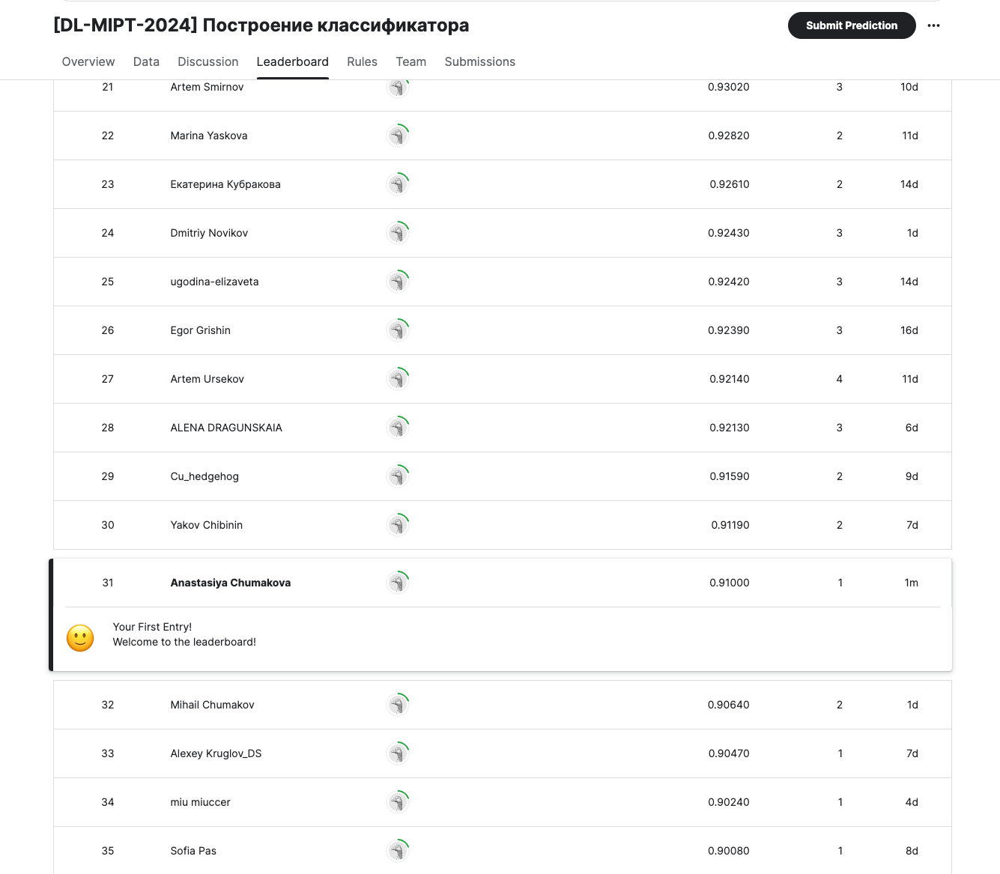

# Соревнование на Kaggle

В рамках данного учебного соревнования вам предстоит построить модель, классифицирующую изображения с одеждой, которая построена на датасете Fashion-MNIST.

Fashion-MNIST — аналог знаменитого датасета MNIST, который состоит не из рукописных символов, а из предметов одежды. Он был создан, чтобы актуализировать учебные задачи в компьютерном зрении и приблизить их к реальности.
Решение более сложной постановки этой задачи может использоваться, например, в маркетплейсах. Покупателю могут рекомендоваться товары по изображениям в соответствии с введенным описанием. Продавцу при загрузке изображений в карточку товара могут автоматически рекомендоваться теги и описание предмета одежды.

Каждое изображение представляет собой набор из 784 пикселей (28x28). Каждый пиксель принимает значение от 0 до 255, обозначая его цвет в черно-белой шкале. Обучающая выборка содержит 786 столбцов, где первый (label) — принадлежность изображения к классу, а последний — его уникальный номер (id). Остальные столбцы — пиксели изображения.

Проведите первичный анализ данных, чтобы определить наличие NaN значений.

Тестовая выборка, на основе которой должно быть получено исследование, содержит все те же столбцы, кроме label.

### Расшифровка классов (label), к которым принадлежат изображения:

 - 0 T-shirt/top — футболка;
 - 1 Trouser — брюки;
 - 2 Pullover — свитер;
 - 3 Dress — платье;
 - 4 Coat — пальто;
 - 5 Sandal — сандалия;
 - 6 Shirt — рубашка;
 - 7 Sneaker — кроссовок;
 - 8 Bag — сумка;
 - 9 Ankle boot — сапог.

### Структура данных:

fmnist_train.csv — обучающая выборка;
fmnist_test.csv — тестовая выборка (на которой должно быть получено предсказание);
sample_submission.csv — пример решения.
Исходная публикация датасета

Задача будет считаться решенной, если в Public Leaderboard вы наберете score, который будет равен 0.80 или больше. В качестве метрики используется accuracy. В день вы можете отправлять не более 20 решений (это ограничения платформы). Помните, что решения принимаются только в том формате, который представлен в файле sample_submission.csv.

### Форма сдачи результата:
В качестве результата пришлите скриншот турнирной таблицы и ссылку на блокнот.

### Скриншот турнирной таблицы
